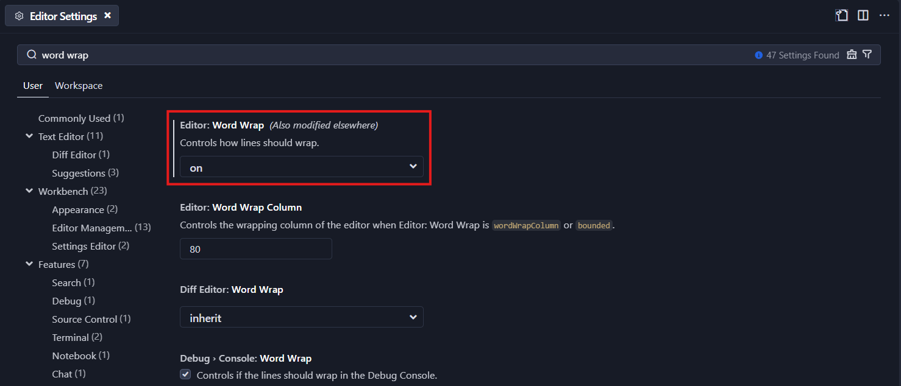

# ⚙️ Word Wrap

controlar si las lineas de codigo deben hacer salto de pagina cuando lleguen al maximo de la resolucion de la pantalla. 

```js
// Comentario lorem ipsum Comentario lorem ipsum Comentario lorem ipsum Comentario lorem ipsum Comentario lorem ipsum Comentario lorem ipsum Comentario lorem ipsum
```
