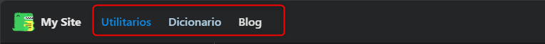

# 🌐 Agregar otro enlance principal 

## Para agregar o personalizar los enlances principales en el menú de navegación superior en Docusaurus sigue estos pasos.

---
## ✨ 1: Crear las carpetas y archivos MDX

1. 📁 Dentro de la carpeta `docs`, crea una nueva carpeta llamada `proyect`.
2. 📝 Dentro de `proyect`, crea un archivo llamado `proyect.mdx` con el siguiente contenido:

```mdx
---
title: Proyectos
---
# Bienvenidos a nuestros proyectos
```

3. 📁 Crea otra carpeta llamada `about` dentro de `docs`.
4. 📝 Dentro de `about`, crea un archivo llamado `about.mdx` con este contenido:

```mdx
---
title: Acerca de
---
# Información sobre nosotros
```

---

## 🛠️ Paso 2: Configurar el menú de navegación superior

1. 📄 Abre el archivo `docusaurus.config.js`.
2. 🔍 Busca la sección `navbar`.
3. 🧩 Agrega los siguientes elementos al arreglo `items` para incluir los enlaces de "Proyectos" y "Acerca de":

```javascript title="docusaurus.config.js" {11-22}
const config = {
  // ...otras configuraciones...
  themeConfig: {
    navbar: {
      title: "Mi sitio",
      logo: {
        alt: "Mi sitio",
        src: "img/logo.svg",
      },
      items: [
        {
          type: "docSidebar",
          sidebarId: "proyectSidebar",
          position: "left",
          label: "📁 Proyectos",
        },
        {
          type: "docSidebar",
          sidebarId: "aboutSidebar",
          position: "left",
          label: "ℹ️ Acerca de",
        },
      ],
    },
  },
};
```

---

## 📚 Paso 3: Configurar las barras laterales

1. 📄 Abre el archivo `sidebars.js`.
2. 🧱 Agrega la siguiente configuración para que Docusaurus genere las barras laterales automáticamente:

```javascript
const sidebars = {
  proyectSidebar: [{ type: 'autogenerated', dirName: 'proyect' }],
  aboutSidebar: [{ type: 'autogenerated', dirName: 'about' }],
};
```
✅ ¡Listo!
Con estos pasos, tu menú de navegación superior incluirá secciones para Proyectos y Acerca de, y cada una tendrá su propia barra lateral. Puedes seguir este patrón para agregar más secciones en el futuro. 🚀